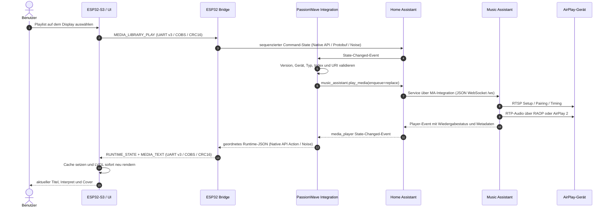
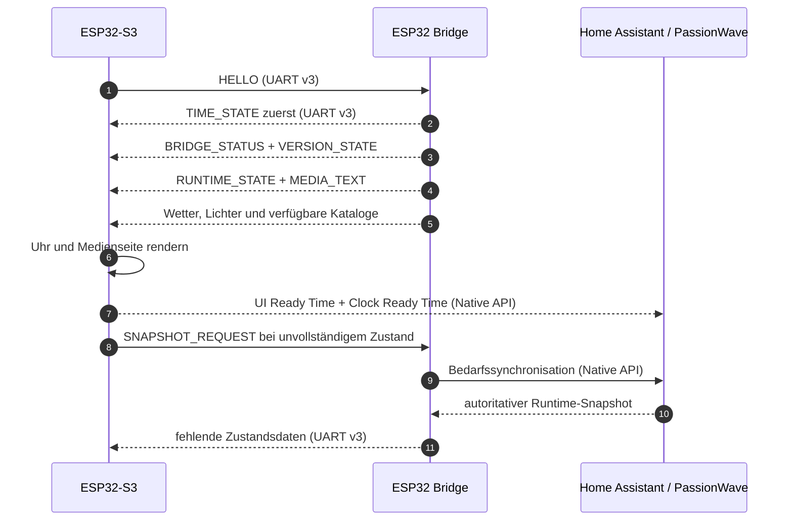
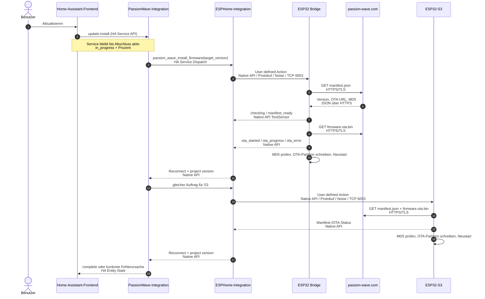

# Dual-MCU Home Assistant bridge

Current coordinated implementation: `3.0.0-beta.19`.

One physical Passion Wave RotaryKnob contains two processors. They share one
product generation but keep separate firmware images, native API identities
and recovery paths.

## Processor ownership

| Processor | Owns | Does not own in normal operation |
| --- | --- | --- |
| ESP32-S3 display | EC1 encoder, touch, LVGL, haptics, local optimistic UI, timers, alarms, display protection and image decoding | Home Assistant command dispatch, Music Assistant library access or normal asset downloads |
| Classic ESP32 Bridge | Home Assistant-facing state, bounded command envelopes, weather, media library paging, light details and HTTP asset downloads | Display rendering or authoritative EC1 input |
| PassionWave integration | Device assignment, target validation, Music Assistant calls, Home Assistant actions, runtime synchronization and coordinated update sequencing | Direct display rendering or inter-MCU transport |

The S3 retains Wi-Fi only for provisioning, encrypted ESPHome Native API, OTA
and diagnostics. Managed V3 compiles neither MQTT nor an S3 application-network
rescue path.

## Komponenten und Protokolle

Das Diagramm trennt Bedienung und Zustandsrückmeldung vom eigentlichen
Audiostrom. Der RotaryKnob empfängt und decodiert zu keinem Zeitpunkt Audio.

```mermaid
flowchart LR
    U[Benutzer] -->|Drehen / Drücken| EC1[EC1 Encoder]
    EC1 -->|GPIO + PCNT| S3[ESP32-S3\nLVGL, Display, Touch, Haptik]
    S3 <-->|UART 2.000.000 Baud\nPW-Protokoll v3, COBS, CRC16\nPrioritäten + ACK| B[Classic ESP32\nBridge]
    B <-->|TCP 6053\nESPHome Native API\nProtobuf + Noise NNpsk0| HA[Home Assistant]
    HA <-->|interne Python-API\nEvents + Service Calls| PW[PassionWave\nIntegration]
    PW -->|HA-Service\nmusic_assistant.play_media\nmedia_id, media_type, enqueue=replace| MAI[Music Assistant\nHA-Integration]
    MAI <-->|JSON WebSocket /ws\nCommands + Events| MAS[Music Assistant\nServer]
    MAS -.->|mDNS / DNS-SD\n_airplay._tcp, _raop._tcp| AP[AirPlay-Gerät]
    MAS ==>|RTSP-Steuerung + RTP/UDP-Audio\nRAOP: ALAC, NTP, optional RSA/AES\nAirPlay 2: verschlüsseltes RTSP/RTP, PTP oder NTP| AP
    MAS -.->|Playerzustand + Metadaten| MAI
    MAI -.->|media_player State Event\nmedia_title, media_artist, entity_picture| HA
    HA -.->|Runtime-JSON über ESPHome Action| B
    B -.->|RUNTIME_STATE + MEDIA_TEXT\nPW v3 / COBS / CRC16| S3
    S3 -.->|LVGL Label + Cover| D[Anzeige]
```

Die verwendete ESPHome Native API läuft als Protobuf-basierter Binärstrom über
TCP 6053; die konfigurierte Noise-Variante authentifiziert und verschlüsselt
die Verbindung. Zwischen den beiden Mikrocontrollern läuft ein eigenes,
gebundenes Protokoll v3: ein Nullbyte terminiert jeden COBS-Frame, CRC16 schützt
Header und Nutzlast, die maximale Nutzlast beträgt 192 Byte. Steuer- und
Zustandsframes erhalten Vorrang vor Bilddaten. Coverbilder werden mit
Begin/Chunk/End, ACK und zusätzlicher CRC32 übertragen.

Der Music-Assistant-Server stellt seine lokale, bidirektionale JSON-API über
WebSocket `/ws` bereit. AirPlay-Endpunkte werden über mDNS/DNS-SD gefunden. Je
nach Eigenschaften und Konfiguration des Empfängers wählt Music Assistant RAOP,
den AirPlay-2-Kompatibilitätsweg oder natives AirPlay 2; RTSP kontrolliert die
Sitzung, während RTP den Audioinhalt transportiert. Der genaue Codec,
Zeitdienst und die Verschlüsselung sind deshalb eine Eigenschaft der
ausgehandelten AirPlay-Route und nicht des RotaryKnobs.

## Wirkkette: Playlist auswählen und Titel anzeigen

Die Auswahl ist erst dann fachlich abgeschlossen, wenn der konfigurierte
Home-Assistant-`media_player` die gewählte `media_content_id` stabil
zurückmeldet. Die Integration verwendet dafür eine
Latest-Command-Wins-Warteschlange, `enqueue=replace`, eine begrenzte
Bestätigungsschleife und höchstens einen Wiederholungsversuch. Dadurch kann ein
langsamer älterer Playlist-Start keine neuere Benutzerauswahl überschreiben.

Für die Anzeige ist ausschließlich der im PassionWave Config Entry gewählte
`media_player` maßgeblich. Bei jedem State Event liest die Integration dessen
`media_title`, `media_artist`, `entity_picture`, Position, Dauer und
Wiedergabestatus. Sie sendet daraus einen geordneten Snapshot an die Bridge.
Der S3 rendert `MEDIA_TEXT` sofort; ein zusätzlicher Snapshot-Request repariert
den Zustand, falls bei laufender Wiedergabe zehn Sekunden lang kein Titel
vorliegt.

## Wirkkette beim Start

Seit Beta.18 steht `TIME_STATE` am Anfang jedes HELLO-Snapshots; die Uhr muss
nicht mehr auf das zehnsekündige Wartungsintervall der Bridge warten. Die
neuen Diagnosewerte `RotaryKnob UI Ready Time`, `RotaryKnob Clock Ready Time`
und `RotaryKnob UI Startup Status` machen die Startzeit ab Boot messbar.

Commands originate as bounded kind/index/value records on the S3. The Bridge
publishes a sequenced command state; the PassionWave integration validates the
command against that physical device's Config Entry, executes only the allowed
Home Assistant or Music Assistant action and returns a named response action.
Broad ESPHome Home Assistant action permission remains disabled.

State snapshots travel in the opposite direction. The Bridge sends changed
media, light, weather, connection and catalog records immediately and a
periodic complete snapshot as loss recovery. The S3 updates preallocated UI
objects and keeps short optimistic holds for volume and light brightness so a
late callback cannot visibly undo the user's current input.

For media there is exactly one authority: the PassionWave integration creates
an ordered snapshot containing state, title, artist, player label, volume,
position, duration, playback options and cover URL; the Bridge caches and
forwards it over UART. Dual-MCU firmware contains no compile-time media-player
subscription and executes no direct Home Assistant or Music Assistant action.
The S3 runtime diagnostics are read-only observations published after UART
receipt, not a second writable desired-state path.

## Media and library

The Config Entry owns the selected Music Assistant instance and player.
PassionWave provides bounded playlist, radio, podcast and playlist-track pages.
The S3 prefetches with five rows remaining; one request-in-flight guard and
generation-tagged responses prevent duplicate or stale page commits.

Media controls use compact commands for previous, play/pause, next, volume,
shuffle, repeat and library selection. The Bridge never accepts an arbitrary
entity ID from the S3; targets come from the Config Entry and authoritative
Bridge cache.

Library playback is coordinated per Config Entry with latest-command-wins
semantics. Every accepted choice receives a local generation; pending older
choices collapse to the newest target and only one Music Assistant service call
runs at a time. A stale generation can neither clear a repeated identical
choice nor send its final callback. Individual tracks use the Music Assistant
`replace` enqueue mode, and the integration confirms their
`media_content_id` with one bounded retry. A newer choice interrupts that
confirmation loop within the 100-ms poll interval. This keeps the final player
state deterministic even when a previous playlist is still preparing its
queue.

## Cover pipeline

The integration sends the selected player's state, title, artist and resolved
cover URL to the Bridge. The Bridge normalizes Music Assistant image-proxy URLs
and transfers the URL to the S3. Compressed cover bytes are downloaded by the
Bridge and sent through the acknowledged UART asset stream; the S3 decodes them
after active input has been quiet.

Fullscreen cover entry requires all of the following:

- media runtime state is `playing`;
- the resolved cover URL is non-empty;
- either page or fullscreen cover decoding is ready;
- no media picker or track selector is open;
- the display is awake;
- at least ten seconds have passed since the cover deadline and the last user
  input.

Useful diagnostics are `ESP32 Media Cover URL Status`, `ESP32 Media Cover Proxy
Status`, `RotaryKnob Media Runtime State`, `RotaryKnob Media Runtime Cover URL`
and `scrollwheel Media Debug Status`. The runtime diagnostics now prove what
the S3 actually received. The live beta.12 cover regression and its OTA retest
are tracked as `PW-UI-003` in `known-issues.md`.

## Lights

Each Config Entry owns up to four ordered light slots. On/off and brightness
snapshots are authoritative on the Bridge. Hue scenes and WLED presets are
resolved there, transferred as generation-tagged label catalogs and activated
only by validated slot/index commands. External Home Assistant changes must
converge back to the display without overwriting an active local brightness
hold.

## Weather and assets

The Bridge owns current weather, daily forecasts and the retry for a missed
startup forecast. Radar, floorplan, photos and media covers share one bounded
asset transport. Control and state frames have priority over bulk chunks; URL,
HTTP, size, timeout, CRC and decoder failures are reported without blocking
navigation.

The weather photographs are compiled into the S3 and selected locally from the
Bridge condition, so the normal weather screensaver needs no image download.

The managed S3 configuration removes inherited direct Home Assistant state
subscriptions and replaces the standalone media, weather and light fetchers
before ESPHome code generation. Consequently the managed S3 binary contains
no Home Assistant service-call objects; only the Bridge publishes bounded
command envelopes for the PassionWave integration.

## Wirkkette Firmware-Update

Das öffentliche Manifest und die Binärdatei werden auf jedem Prozessor direkt
per HTTPS geladen; der Firmwareinhalt läuft weder durch Home Assistant noch
durch UART. Home Assistant koordiniert nur Reihenfolge, Zielversion und
Verifikation. Bei Firmware vor Beta.19 reaktiviert die Integration für genau
einen Übergang die verborgene native ESPHome-Update-Entität, ruft zuerst
`homeassistant.update_entity` auf und verwendet danach `update.install`. Damit
wird auch ein alter sechs-Stunden-Cache vor dem ersten Beta.19-Flash ersetzt.

## Recovery behavior

- Bridge loss leaves encoder, touch, local UI, timer, alarm and display
  protection operational. Remote features show an unavailable state and do not
  start a fallback network path.
- S3 restart triggers Bridge snapshots until runtime state and all four light
  catalogs converge again.
- Bridge or Home Assistant restart preserves the last complete UI data where
  safe and refreshes it after the API reconnects.
- Both processors retain independent encrypted API, OTA and serial recovery.
- Coordinated customer update order is Bridge → verified reconnect → S3 →
  verified reconnect. A Bridge failure stops before the S3 phase.

## Diagnostics and acceptance

The primary health signals are:

- `S3 Link Connected` and `ESP32 Coprocessor Link` on;
- `EC1 Encoder Ready` on;
- `RotaryKnob UI Ready Time` shows when LVGL first became operational;
- `RotaryKnob Clock Ready Time` shows when the first valid time reached the UI;
- `RotaryKnob UI Startup Status` distinguishes UI readiness, clock readiness
  and incomplete startup data;
- `RotaryKnob Rendered Media Title` is the actual text read back from the LVGL
  title label, while `RotaryKnob Media Runtime Title` is the title received
  from the Bridge. Equal non-empty values prove transport and rendering;
- `EC1 Encoder Read Errors`, `UART Protocol Errors` and `Inter-MCU Protocol
  Errors` unchanged at zero after startup;
- finite link ping and bounded `S3 UI Scheduler Gap` during active input;
- matching runtime state on the selected Home Assistant player, Bridge and S3.

Execute the current live matrix in [Known issues](known-issues.md) and the
detailed [responsiveness test catalog](stage1-responsiveness-test-catalog.md)
for each physical RotaryKnob. A profile or Home Assistant entry alone is not
evidence that its corresponding processor has passed physical acceptance.

Protocol references: the ESPHome developer documentation describes the
[Native API wire format and Noise framing](https://developers.esphome.io/architecture/api/protocol_details/).
Music Assistant documents its [WebSocket `/ws` API endpoint](https://github.com/music-assistant/server/blob/dev/music_assistant/controllers/webserver/README.md)
and the current [AirPlay provider, discovery and timing behavior](https://github.com/music-assistant/server/blob/dev/music_assistant/providers/airplay/README.md).
